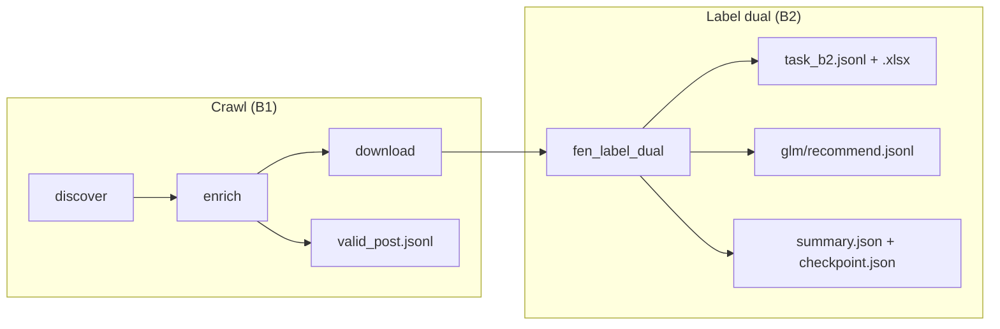

# Label dual — file output, upsert & flush

This document explains the exam stack’s **primary OCR flow**: **label dual** (Gemini ∥ Paddle → fuse → GLM). Read alongside [USER_SETUP.md](USER_SETUP.md) when triggering DAGs.

---

## 0. Role of each model (OCR / label dual)

Flow for one image (B2):

```
MinIO image
  ├─ Gemini (vision)  ──► branch A (text_a) ──► GPT refine (gpt_a)
  │                                              │
  │                         DeepSeek (optional) ─┤  order / columns
  │                                              ▼
  └─ Paddle (local)   ──► branch B (text_b) ──► GPT refine (gpt_b)
                                                 │
                                                 ▼
                                               Fuse  ──► ground_truth (submit column)
                                                 │
                                                 ▼
                                               GLM judge ──► recommend / silver|HITL
                                                         (fuse_gt match check)
```

| Model / service | Stage | What it does | Key / endpoint |
|-----------------|-------|--------------|----------------|
| **Gemini** (vision) | Label dual — branch **A** | Primary OCR from the image (ink + boxes) → `text_a`, column `gemini` on B2 | `FEN_LABEL_GEMINI_API_KEY` → `[fen_label_gemini]` |
| **PaddleOCR** | Label dual — branch **B** | Local OCR in parallel with Gemini → `text_b` | Service `http://paddle-ocr:8080/ocr` (no Ramcloud key) |
| **GPT** | Refine before fuse | Clean / refine each branch (`gpt_a`, `gpt_b`) before fuse | `FEN_LABEL_GPT_API_KEY` → `[fen_label_gpt]` |
| **DeepSeek** (optional) | Layout assist | Suggest column / RTL reading order (`ds_a`, `ds_b`); missing key → skip, does not block the pipeline | `FEN_LABEL_DEEPSEEK_API_KEY` |
| **Fuse** (rule + vote) | After both branches | Merge A∥B → **`ground_truth`** for B2 submission (`fuse_gt` in GLM logs) | Job code (no separate model call) |
| **GLM** | Judge / QC | Compare recommend vs fuse → `glm/recommend.jsonl`, attach `silver` / `needs_hitl` | `FEN_LABEL_GLM_API_KEY` → `[fen_label_glm]` |

**Do not confuse with crawl:**

| Model | Stage | What it does | Key |
|-------|-------|--------------|-----|
| **Gemini** (classify) | Enrich — calligraphy gate | Classifies handwritten / printed / spam only — **does not** OCR text for B2 | `FEN_CALLIGRAPHY_API_KEY` → `[fen_calligraphy]` |
| Legacy single OCR | `fen_ocr_pipeline` | One model — **not** used for new B2 submissions | `FEN_OCR_API_KEY` → `[fen_ocr]` |

**Task B2 columns (submission):** `image`, `label`, `ground_truth` (from fuse), `gemini` (branch A text), `post_link`.  
Debug fields (`phases.*`, `text_b`, flags): see sections below and `glm/recommend.jsonl`.

---

## 1. Which pipeline creates which files?



| DAG | When to use | Main JSONL / XLSX files |
|-----|-------------|-------------------------|
| **`fen_e2e_pipeline`** | One crawl batch → label dual (**no** catch-bottom) | B1 + B2 (see tables below) |
| **`fen_crawl_pipeline`** | Multi-batch crawl + auto-trigger label dual (`catch_bottom`) | B1 + B2 |
| **`fen_label_dual_pipeline`** | Label dual only (images already on MinIO) | B2 |
| `fen_ocr_pipeline` | Legacy — **not** used for new B2 submissions | `ocr/ocr_result.jsonl` only |

All paths below live in bucket **`final-exam-nlp-raw`**, prefix **`facebook/{group_id}/`**.

### B1 — Crawl (Task.xlsx sheet B1)

| File | Contents |
|------|----------|
| `export/valid_post.jsonl` | Posts that passed the calligraphy gate |
| `export/invalid_post.jsonl` | Rejected posts |

**Upsert:** by `post_id`, written **once at the end of each enrich batch** (not flushed per post).

### B2 — Label dual (Task.xlsx sheet B2)

| File | Contents |
|------|----------|
| **`ocr/label_dual_pilot/task_b2.jsonl`** | MinIO — full B2 (+ `side_matter`) |
| **`ocr/label_dual_pilot/task_b2.xlsx`** | MinIO — same as jsonl |
| **`output/{group_id}/task_b2.jsonl`** | Host local — **pure submit** (no `side_matter`) |
| **`output/{group_id}/task_b2.xlsx`** | Host local — same 5 columns |

### Pure Task B2 submit (local `/tmp` → host `output/`)

After each label dual run, the job also writes 2 pure submission files (bind mount `./output` → `/tmp/fen-output`):

| Column | Present |
|--------|---------|
| `image` | ✅ |
| `label` | ✅ |
| `ground_truth` | ✅ |
| `gemini` | ✅ |
| `post_link` | ✅ |
| `side_matter` | ❌ no |

```
output/{group_id}/
  task_b2.jsonl
  task_b2.xlsx
```

No flags / GLM / fuse metrics mixed in. MinIO `label_dual_pilot/` still keeps the full copy (with `side_matter`) for debugging.

| File | Contents |
|------|----------|
| `ocr/label_dual_pilot/glm/recommend.jsonl` | GLM + **`fuse_gt`**, bag, cer, … |
| `ocr/label_dual_pilot/flags.jsonl` | Per-image QC (silver / flagged) |

### Index files

| File | Purpose |
|------|---------|
| **`ocr/label_dual_pilot/summary.json`** | Run stats: `n_images`, `processed_this_run`, `skipped_this_run`, `n_silver`, `target`, `more_pending`, pointers to task_b2 / GLM |
| **`ocr/label_dual_pilot/checkpoint.json`** | `done_images[]`, `last_flush_at`, chunk state |
| `ocr/label_dual_pilot/glm/summary.json` | GLM pass summary |
| `ocr/label_dual_pilot/parts/b2/batch_XX.jsonl` | Partials by queue (1–12) — for resume |

**HITL (not for submission):** `tester/manifest.json`, `tester/review.xlsx`.

---

## 1.1 Detailed metrics (beyond `task_b2`)

`task_b2.jsonl` keeps only the **6 B2 submission columns** (`image`, `label`, `ground_truth`, `side_matter`, `gemini`, `post_link`).  
All quality / debug metrics live in other files under the same prefix `ocr/label_dual_pilot/`.

### A. Run-level metrics (one JSON file per run)

| File | Used for |
|------|----------|
| **`summary.json`** | Run dashboard: `n_images`, `processed_this_run`, `skipped_this_run`, `n_silver`, `n_flagged`, `target`, `more_pending`, `chunk`, `batch_results`, GLM pointer |
| **`checkpoint.json`** | Resume: `done_images[]`, `last_flush_at`, `more_pending`, `batch_seq` |
| **`glm/summary.json`** | GLM aggregate: `n_silver`, `n_hitl`, `n_agree_silver`, `n_pick_a/b`, `mean_conf_*`, `p50/p95_latency_ms`, `glm_flag_counts`, … |

Quick read examples:

```bash
mc cat local/final-exam-nlp-raw/facebook/{group_id}/ocr/label_dual_pilot/summary.json | python3 -m json.tool
mc cat local/final-exam-nlp-raw/facebook/{group_id}/ocr/label_dual_pilot/glm/summary.json | python3 -m json.tool
```

### B. Per-image metrics — `flags.jsonl`

One line per image, upserted by `image`:

| Field | Meaning |
|-------|---------|
| `status` | `silver` = branches A≈B clean enough; `needs_hitl` = human review needed |
| `flags` | Error/warning tags: `ocr_unreadable`, `paddle_empty`, `ui_chrome`, `ocr_suspect`, `seal_only`, … |
| `post_id`, `post_link` | Link back to the Facebook post |

Use this to **filter images that need review** without opening every page JSON.

### C. Per-image metrics — `glm/recommend.jsonl` (most complete)

This is the **per-image** label dual log. Each line includes:

| Field group | Example metrics |
|-------------|-----------------|
| **GT & GLM** | `fuse_gt`, `recommend_ground_truth`, `agree_with_fuse` (in `metrics`) |
| **Status** | `page_status`, `review_bucket`, `glm_flags` |
| **Two OCR branches** | `text_a` (Gemini track), `text_b` (Paddle track) |
| **`phases.*`** | `gemini`/`paddle`/`gpt_a`/`gpt_b`/`ds_a`/`ds_b` confidence, `n_ink`, `n_boxes`, Paddle latency |
| **`phases.align`** | `cer`, `bag`, `cluster_bag`, `compact_bag`, `caption_align` |
| **`phases.fuse`** | `gt_track`, `n_locked`, `n_hitl_spans` |
| **`phases.glm`** | `pick`, `recommend_source`, `vote_score`, `gate_ok`, `latency_ms` |
| **`metrics`** | `rec_vs_fuse_bag/cer`, `rec_vs_a_*`, `rec_vs_b_*`, box/ink conf mean/min, `vote` |
| **`boxes`** | Raw Gemini + Paddle boxes (bbox debug) |

**Relation to B2:**

- `task_b2.ground_truth` = **fuse** GT (after Gemini∥Paddle → fuse) — **submission column**.
- `fuse_gt` in recommend = same fuse source, used to compare with `recommend_ground_truth` (GLM).
- `glm_recommend` is **not** written into B2 automatically; it is suggestion / evaluation only.

Raw GLM (full prompt/response): `glm/runs/{run_id}.jsonl`.

### D. Fuse sidecar — `pages/{post_id}/{image}.json`

Full fuse state for **one image**: lines, locked_lines, hitl_spans, gemini/paddle tracks, caption_align, page_conf, …  
Use when you need deeper debug than `recommend.jsonl`. Re-runs skip OCR if the page file already exists.

### E. Partials & queues (resume / operations)

| Path | Role |
|------|------|
| `parts/b2/batch_XX.jsonl` | B2 snapshot per queue 1–12 after each flush |
| `parts/flags/batch_XX.jsonl` | Flags snapshot per queue |
| `parts/glm/batch_XX.jsonl` | GLM snapshot per queue |
| `queues/quote_batch_XX.jsonl` | Quote image queue (created by `prepare_queues`) |
| `queues/priority_longline.jsonl` | Priority queue for long single-line GT |

### F. Crawl (B1) — metrics outside label dual

| File | Metrics |
|------|---------|
| `crawl/checkpoint.json` | `batch_seq`, `should_continue`, `stats.enriched/valid/invalid`, cursor |
| `export/valid_post.jsonl` | Post metadata + calligraphy gate |

### G. Merge legacy (job exists; exam DAGs do not expose yet)

`merge/task_b2_merged.jsonl`, `merge_manifest.jsonl`, `merge_summary.json` — compare fuse vs legacy `ocr_result.jsonl` (`bag_fuse_vs_legacy`, `diverge_flag`).

### H. Tester HITL (not for submission)

`tester/review.xlsx` + `tester/manifest.json` — review sheet with `fuse_ground_truth`, `glm_recommend`, `cer`, `bag`, `page_status`, …

---

### Summary: which file to read for what?

| Purpose | Read file |
|---------|-----------|
| Pure B2 submission (no `side_matter`) | `output/{group_id}/task_b2.jsonl` / `.xlsx` |
| Full MinIO copy (with `side_matter`) | `ocr/label_dual_pilot/task_b2.jsonl` |
| Check if run finished, how many images | `summary.json`, `checkpoint.json` |
| Filter images needing human review | `flags.jsonl` (`status=needs_hitl`) |
| Compare GLM vs fuse, CER/bag, per-phase conf | `glm/recommend.jsonl` |
| Aggregate GLM quality for the whole run | `glm/summary.json` |
| Debug fuse line-by-line / character-level | `pages/...json` |
| Manual grading / HITL | `tester/review.xlsx` |

---

## 2. How does upsert work?

### Label dual (B2)

- Key: **`image`** (image path).
- Each flush: read existing jsonl on MinIO → merge map by `image` → write back.
- Re-run without **`force`**: images that already have a page sidecar → **skip** OCR (GLM may still run if missing).
- `force=true`: re-OCR even completed images.

### Crawl B1

- Key: **`post_id`**.
- Posts that flip valid ↔ invalid are moved between `valid_post.jsonl` and `invalid_post.jsonl`.

---

## 3. Flush — how many images at a time?

DAG param: **`flush_posts`** → env `FEN_LABEL_FLUSH_POSTS`.

> The param is named `flush_posts` but it **counts images** (`pending_b2`), not Facebook posts.

| Source | Default value |
|--------|---------------|
| `fen_label_dual_pipeline` | **5** |
| `fen_e2e_pipeline` | **5** |
| `fen_crawl_pipeline` → trigger label dual | **5** (passed via conf) |
| Job code (`FLUSH_POSTS`) | 10 (only when env is unset) |

Each flush writes concurrently (when there is new data):

1. `parts/b2/batch_XX.jsonl` (queue snapshot)
2. Upsert `task_b2.jsonl`
3. Upsert `flags.jsonl`
4. Upsert `glm/recommend.jsonl`

End of run: rebuild **`task_b2.xlsx`**, update **`summary.json`** + **`checkpoint.json`**.

Example trigger with a different flush:

```json
{
  "group_id": "322453387859386",
  "label_limit": 0,
  "flush_posts": 10
}
```

---

## 4. Important parameters

| Param | Meaning | Default |
|-------|---------|---------|
| `ocr_limit` / `label_limit` | Max **pending images** per run; `0` = full queue | `0` |
| `flush_posts` | Upsert jsonl every N **images** | `5` |
| `prepare_queues` | Sync `quote_01..12` from **`valid_post`**: missing shard / changed image set → rebuild; unchanged → keep. Legacy: `FEN_LABEL_QUOTE_FILTER=true` | `true` |
| `prepare_force` | Force rewrite queues even if the image set is unchanged | `false` |
| `FEN_LABEL_CLEAN_GT` | After fuse: strip emoji/Latin/watermark from GT+SM before writing B2 | `true` |
| `FEN_LABEL_CLEAN_GT_KEEP_HAN_PUNCT` | Keep Han punctuation `，。！？「」…` when cleaning | `true` |
| `glm` | Run GLM → `fuse_gt` in recommend | `true` |
| `force` | Re-OCR completed images | `false` |
| `batch_seq` | **Quote shard** 1–12 (`0` = all). Not the crawl `batch_seq` | `0` |
| `workers` | Parallelism (exam Docker: 4 is safe) | `4` |

**`ocr_limit=0`:** enables `FEN_LABEL_UNLIMITED` — not capped by the 300-images-per-run chunk.

**E2E / after crawl:** always use `batch_seq=0` (or omit the param) so all newly crawled images are OCR’d. With few images, prepare may place them in queues 8–12; setting `batch_seq=1` would run an empty queue.

---

## 5. Required API keys

In `.env` / `make configure`:

| Key | Stage |
|-----|-------|
| `FEN_CALLIGRAPHY_API_KEY` | Enrich — calligraphy gate |
| `FEN_LABEL_GEMINI_API_KEY` | Label dual — Gemini vision |
| `FEN_LABEL_GPT_API_KEY` | Label dual — GPT track |
| `FEN_LABEL_GLM_API_KEY` | Label dual — GLM recommend |
| `FEN_LABEL_DEEPSEEK_API_KEY` | Label dual — DeepSeek (if the job uses it) |
| Paddle | No key needed — service `http://paddle-ocr:8080/ocr` in Docker |

`FEN_OCR_API_KEY` is only for **`fen_ocr_pipeline`** (legacy).

---

## 6. Quick checks on MinIO

After label dual finishes:

```bash
make verify
# or MinIO console → final-exam-nlp-raw → facebook/{group_id}/ocr/label_dual_pilot/
```

| Should see | Meaning |
|------------|---------|
| `task_b2.jsonl` | At least 1 B2 line |
| `summary.json` | Run finished, has `n_images` |
| `glm/recommend.jsonl` | Has `fuse_gt` (if `glm=true`) |

Read one GLM line:

```bash
mc cat local/final-exam-nlp-raw/facebook/{group_id}/ocr/label_dual_pilot/glm/recommend.jsonl | head -1 | python3 -m json.tool
```

---

## 7. Compared to legacy `fen_ocr`

| | Label dual | Legacy `fen_ocr` |
|--|------------|------------------|
| Output | `ocr/label_dual_pilot/` | `ocr/ocr_result.jsonl` |
| XLSX | Has `task_b2.xlsx` | No |
| `fuse_gt` | Yes (GLM) | No |
| Index | `summary.json`, `checkpoint.json` | End-of-run log only |
| Flush default | 5 images (DAG) | 5 images (`FEN_OCR_FLUSH_EVERY`) |

---

## Related docs

- [USER_SETUP.md](USER_SETUP.md) — setup & trigger JSON
- [PIPELINE_BUILD_DEPLOY_RUN.md](PIPELINE_BUILD_DEPLOY_RUN.md) — build/deploy E2E
- [GRADER_GUIDE.md](GRADER_GUIDE.md) — grading checklist
