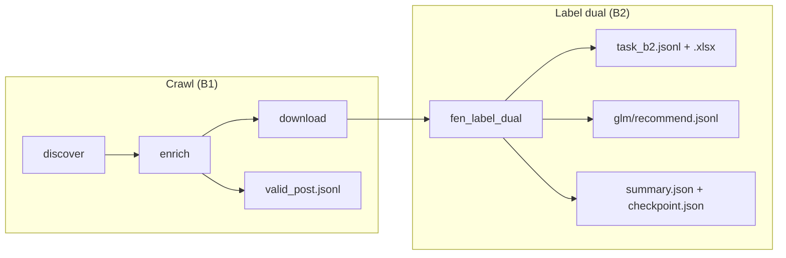

# Label dual — file output, upsert & flush

Tài liệu này giải thích **luồng OCR chính** của exam stack: **label dual** (Gemini ∥ Paddle → fuse → GLM). Đọc kèm [USER_SETUP.md](USER_SETUP.md) khi trigger DAG.

---

## 0. Công dụng từng mô hình (OCR / label dual)

Luồng một ảnh (B2):

```
Ảnh MinIO
  ├─ Gemini (vision)  ──► nhánh A (text_a) ──► GPT refine (gpt_a)
  │                                              │
  │                         DeepSeek (optional) ─┤  order / cột
  │                                              ▼
  └─ Paddle (local)   ──► nhánh B (text_b) ──► GPT refine (gpt_b)
                                                 │
                                                 ▼
                                               Fuse  ──► ground_truth (cột nộp)
                                                 │
                                                 ▼
                                               GLM judge ──► recommend / silver|HITL
                                                         (fuse_gt so khớp)
```

| Mô hình / service | Stage | Việc làm | Key / endpoint |
|-------------------|-------|----------|----------------|
| **Gemini** (vision) | Label dual — nhánh **A** | OCR chính từ ảnh (ink + boxes) → `text_a`, cột `gemini` trên B2 | `FEN_LABEL_GEMINI_API_KEY` → `[fen_label_gemini]` |
| **PaddleOCR** | Label dual — nhánh **B** | OCR local song song Gemini → `text_b` | Service `http://paddle-ocr:8080/ocr` (không cần Ramcloud) |
| **GPT** | Refine trước fuse | Làm sạch / chỉnh từng nhánh (`gpt_a`, `gpt_b`) trước khi fuse | `FEN_LABEL_GPT_API_KEY` → `[fen_label_gpt]` |
| **DeepSeek** (optional) | Hỗ trợ layout | Gợi ý thứ tự đọc cột / RTL (`ds_a`, `ds_b`); thiếu key → skip, không chặn pipeline | `FEN_LABEL_DEEPSEEK_API_KEY` |
| **Fuse** (rule + vote) | Sau 2 nhánh | Ghép A∥B → **`ground_truth`** nộp B2 (`fuse_gt` trong log GLM) | Code trong job (không gọi model riêng) |
| **GLM** | Judge / QC | So recommend vs fuse → `glm/recommend.jsonl`, gắn `silver` / `needs_hitl` | `FEN_LABEL_GLM_API_KEY` → `[fen_label_glm]` |

**Không nhầm với crawl:**

| Mô hình | Stage | Việc làm | Key |
|---------|-------|----------|-----|
| **Gemini** (classify) | Enrich — calligraphy gate | Chỉ phân loại handwritten / printed / spam — **không** OCR chữ cho B2 | `FEN_CALLIGRAPHY_API_KEY` → `[fen_calligraphy]` |
| Legacy single OCR | `fen_ocr_pipeline` | Một model — **không** dùng cho nộp B2 mới | `FEN_OCR_API_KEY` → `[fen_ocr]` |

**Cột Task B2 (nộp):** `image`, `label`, `ground_truth` (từ fuse), `gemini` (text nhánh A), `post_link`.  
Chi tiết field debug (`phases.*`, `text_b`, flags): mục dưới và `glm/recommend.jsonl`.

---

## 1. Pipeline nào tạo file gì?



| DAG | Khi dùng | File JSONL / XLSX chính |
|-----|----------|-------------------------|
| **`fen_e2e_pipeline`** | Một batch crawl → label dual (**không** bắt đáy) | B1 + B2 (xem bảng dưới) |
| **`fen_crawl_pipeline`** | Crawl nhiều batch + auto trigger label dual (`catch_bottom`) | B1 + B2 |
| **`fen_label_dual_pipeline`** | Chỉ chạy label dual (đã có ảnh trên MinIO) | B2 |
| `fen_ocr_pipeline` | Legacy — **không** dùng cho nộp B2 mới | `ocr/ocr_result.jsonl` only |

Tất cả path dưới đây nằm trong bucket **`final-exam-nlp-raw`**, prefix **`facebook/{group_id}/`**.

### B1 — Crawl (Task.xlsx sheet B1)

| File | Nội dung |
|------|----------|
| `export/valid_post.jsonl` | Post qua gate thư pháp |
| `export/invalid_post.jsonl` | Post loại |

**Upsert:** theo `post_id`, ghi **một lần cuối batch enrich** (không flush từng post).

### B2 — Label dual (Task.xlsx sheet B2)

| File | Nội dung |
|------|----------|
| **`ocr/label_dual_pilot/task_b2.jsonl`** | MinIO — full B2 (+ `side_matter`) |
| **`ocr/label_dual_pilot/task_b2.xlsx`** | MinIO — same as jsonl |
| **`output/{group_id}/task_b2.jsonl`** | Host local — **pure submit** (no `side_matter`) |
| **`output/{group_id}/task_b2.xlsx`** | Host local — same 5 columns |

### Pure Task B2 submit (local `/tmp` → host `output/`)

Sau mỗi run label dual, job ghi thêm 2 file nộp thuần (bind mount `./output` → `/tmp/fen-output`):

| Cột | Có |
|-----|-----|
| `image` | ✅ |
| `label` | ✅ |
| `ground_truth` | ✅ |
| `gemini` | ✅ |
| `post_link` | ✅ |
| `side_matter` | ❌ không |

```
output/{group_id}/
  task_b2.jsonl
  task_b2.xlsx
```

Không lẫn flags / GLM / fuse metrics. MinIO `label_dual_pilot/` vẫn giữ bản đầy đủ (có `side_matter`) để debug.

| File | Nội dung |
|------|----------|
| `ocr/label_dual_pilot/glm/recommend.jsonl` | GLM + **`fuse_gt`**, bag, cer, … |
| `ocr/label_dual_pilot/flags.jsonl` | QC từng ảnh (silver / flagged) |

### File chỉ số

| File | Mục đích |
|------|----------|
| **`ocr/label_dual_pilot/summary.json`** | Thống kê run: `n_images`, `processed_this_run`, `skipped_this_run`, `n_silver`, `target`, `more_pending`, pointer tới task_b2 / GLM |
| **`ocr/label_dual_pilot/checkpoint.json`** | `done_images[]`, `last_flush_at`, trạng thái chunk |
| `ocr/label_dual_pilot/glm/summary.json` | Tóm tắt pass GLM |
| `ocr/label_dual_pilot/parts/b2/batch_XX.jsonl` | Partial theo queue (1–12) — phục vụ resume |

**HITL (không nộp bài):** `tester/manifest.json`, `tester/review.xlsx`.

---

## 1.1 Chỉ số chi tiết (ngoài `task_b2`)

`task_b2.jsonl` chỉ giữ **6 cột nộp B2** (`image`, `label`, `ground_truth`, `side_matter`, `gemini`, `post_link`).  
Mọi chỉ số chất lượng / debug nằm ở các file khác dưới cùng prefix `ocr/label_dual_pilot/`.

### A. Chỉ số cấp run (một file JSON / run)

| File | Dùng để |
|------|---------|
| **`summary.json`** | Dashboard run: `n_images`, `processed_this_run`, `skipped_this_run`, `n_silver`, `n_flagged`, `target`, `more_pending`, `chunk`, `batch_results`, pointer GLM |
| **`checkpoint.json`** | Resume: `done_images[]`, `last_flush_at`, `more_pending`, `batch_seq` |
| **`glm/summary.json`** | Tổng hợp GLM: `n_silver`, `n_hitl`, `n_agree_silver`, `n_pick_a/b`, `mean_conf_*`, `p50/p95_latency_ms`, `glm_flag_counts`, … |

Ví dụ đọc nhanh:

```bash
mc cat local/final-exam-nlp-raw/facebook/{group_id}/ocr/label_dual_pilot/summary.json | python3 -m json.tool
mc cat local/final-exam-nlp-raw/facebook/{group_id}/ocr/label_dual_pilot/glm/summary.json | python3 -m json.tool
```

### B. Chỉ số cấp ảnh — `flags.jsonl`

Một dòng / ảnh, upsert theo `image`:

| Field | Ý nghĩa |
|-------|---------|
| `status` | `silver` = hai nhánh A≈B đủ sạch; `needs_hitl` = cần người xem |
| `flags` | Tag lỗi/cảnh báo: `ocr_unreadable`, `paddle_empty`, `ui_chrome`, `ocr_suspect`, `seal_only`, … |
| `post_id`, `post_link` | Liên kết về post Facebook |

Dùng để **lọc ảnh cần review** mà không mở từng page JSON.

### C. Chỉ số cấp ảnh — `glm/recommend.jsonl` (đầy đủ nhất)

Đây là log **per-image** của label dual. Mỗi dòng gồm:

| Nhóm field | Ví dụ chỉ số |
|------------|----------------|
| **GT & GLM** | `fuse_gt`, `recommend_ground_truth`, `agree_with_fuse` (trong `metrics`) |
| **Trạng thái** | `page_status`, `review_bucket`, `glm_flags` |
| **Hai nhánh OCR** | `text_a` (Gemini track), `text_b` (Paddle track) |
| **`phases.*`** | `gemini`/`paddle`/`gpt_a`/`gpt_b`/`ds_a`/`ds_b` confidence, `n_ink`, `n_boxes`, latency Paddle |
| **`phases.align`** | `cer`, `bag`, `cluster_bag`, `compact_bag`, `caption_align` |
| **`phases.fuse`** | `gt_track`, `n_locked`, `n_hitl_spans` |
| **`phases.glm`** | `pick`, `recommend_source`, `vote_score`, `gate_ok`, `latency_ms` |
| **`metrics`** | `rec_vs_fuse_bag/cer`, `rec_vs_a_*`, `rec_vs_b_*`, box/ink conf mean/min, `vote` |
| **`boxes`** | Raw boxes Gemini + Paddle (debug bbox) |

**Quan hệ với B2:**

- `task_b2.ground_truth` = GT **fuse** (đã qua Gemini∥Paddle → fuse) — **cột nộp**.
- `fuse_gt` trong recommend = cùng nguồn fuse, dùng so với `recommend_ground_truth` (GLM).
- `glm_recommend` **không** tự ghi vào B2; chỉ gợi ý / đánh giá.

Raw GLM (prompt/response đầy đủ): `glm/runs/{run_id}.jsonl`.

### D. Sidecar fuse — `pages/{post_id}/{image}.json`

Toàn bộ state fuse **một ảnh**: lines, locked_lines, hitl_spans, gemini/paddle tracks, caption_align, page_conf, …  
Dùng khi cần debug sâu hơn `recommend.jsonl`. Re-run skip OCR nếu file page đã tồn tại.

### E. Partial & queue (resume / vận hành)

| Path | Vai trò |
|------|---------|
| `parts/b2/batch_XX.jsonl` | Snapshot B2 theo queue 1–12 sau mỗi flush |
| `parts/flags/batch_XX.jsonl` | Snapshot flags theo queue |
| `parts/glm/batch_XX.jsonl` | Snapshot GLM theo queue |
| `queues/quote_batch_XX.jsonl` | Hàng đợi ảnh quote (tạo bởi `prepare_queues`) |
| `queues/priority_longline.jsonl` | Queue ưu tiên GT một dòng dài |

### F. Crawl (B1) — chỉ số ngoài label dual

| File | Chỉ số |
|------|--------|
| `crawl/checkpoint.json` | `batch_seq`, `should_continue`, `stats.enriched/valid/invalid`, cursor |
| `export/valid_post.jsonl` | Metadata post + calligraphy gate |

### G. Merge legacy (job có, DAG exam chưa expose)

`merge/task_b2_merged.jsonl`, `merge_manifest.jsonl`, `merge_summary.json` — so sánh fuse vs `ocr_result.jsonl` cũ (`bag_fuse_vs_legacy`, `diverge_flag`).

### H. Tester HITL (không nộp)

`tester/review.xlsx` + `tester/manifest.json` — sheet review với `fuse_ground_truth`, `glm_recommend`, `cer`, `bag`, `page_status`, …

---

### Tóm tắt: file nào đọc khi cần gì?

| Mục đích | Đọc file |
|----------|----------|
| Nộp bài B2 thuần (không `side_matter`) | `output/{group_id}/task_b2.jsonl` / `.xlsx` |
| Bản MinIO đầy đủ (có `side_matter`) | `ocr/label_dual_pilot/task_b2.jsonl` |
| Xem run xong chưa, bao nhiêu ảnh | `summary.json`, `checkpoint.json` |
| Lọc ảnh cần người xem | `flags.jsonl` (`status=needs_hitl`) |
| So GLM vs fuse, CER/bag, conf từng phase | `glm/recommend.jsonl` |
| Tổng hợp chất lượng GLM cả run | `glm/summary.json` |
| Debug fuse từng dòng/chữ | `pages/...json` |
| Chấm thủ công / HITL | `tester/review.xlsx` |

---

## 2. Upsert hoạt động thế nào?

### Label dual (B2)

- Key: **`image`** (đường dẫn ảnh).
- Mỗi lần flush: đọc jsonl cũ trên MinIO → merge map theo `image` → ghi lại.
- Chạy lại **không** `force`: ảnh đã có page sidecar → **skip** OCR (vẫn có thể chạy GLM nếu thiếu).
- `force=true`: OCR lại cả ảnh đã xong.

### Crawl B1

- Key: **`post_id`**.
- Post đổi valid ↔ invalid được chuyển giữa `valid_post.jsonl` và `invalid_post.jsonl`.

---

## 3. Flush — bao nhiêu ảnh một lần?

Tham số DAG: **`flush_posts`** → env `FEN_LABEL_FLUSH_POSTS`.

> Tên param là `flush_posts` nhưng **đếm theo ảnh** (`pending_b2`), không phải số post Facebook.

| Nguồn | Giá trị mặc định |
|-------|------------------|
| `fen_label_dual_pipeline` | **5** |
| `fen_e2e_pipeline` | **5** |
| `fen_crawl_pipeline` → trigger label dual | **5** (truyền qua conf) |
| Code job (`FLUSH_POSTS`) | 10 (chỉ khi không set env) |

Mỗi flush ghi đồng thời (nếu có dữ liệu mới):

1. `parts/b2/batch_XX.jsonl` (snapshot queue)
2. Upsert `task_b2.jsonl`
3. Upsert `flags.jsonl`
4. Upsert `glm/recommend.jsonl`

Cuối run: build lại **`task_b2.xlsx`**, cập nhật **`summary.json`** + **`checkpoint.json`**.

Ví dụ trigger với flush khác:

```json
{
  "group_id": "322453387859386",
  "label_limit": 0,
  "flush_posts": 10
}
```

---

## 4. Tham số quan trọng

| Param | Ý nghĩa | Default |
|-------|---------|---------|
| `ocr_limit` / `label_limit` | Tối đa **ảnh pending** mỗi run; `0` = full queue | `0` |
| `flush_posts` | Upsert jsonl mỗi N **ảnh** | `5` |
| `prepare_queues` | Đồng bộ `quote_01..12` từ **`valid_post`**: thiếu shard / tập ảnh đổi → rebuild; trùng → giữ. Legacy: `FEN_LABEL_QUOTE_FILTER=true` | `true` |
| `prepare_force` | Ép ghi lại queue dù tập ảnh không đổi | `false` |
| `glm` | Chạy GLM → `fuse_gt` trong recommend | `true` |
| `force` | OCR lại ảnh đã xong | `false` |
| `batch_seq` | **Quote shard** 1–12 (`0` = tất cả). Không phải crawl `batch_seq` | `0` |
| `workers` | Song song (exam Docker: 4 an toàn) | `4` |

**`ocr_limit=0`:** bật `FEN_LABEL_UNLIMITED` — không bị giới hạn chunk 300 ảnh/run.

**E2E / sau crawl:** luôn dùng `batch_seq=0` (hoặc bỏ param) để OCR hết ảnh vừa crawl. Với ít ảnh, prepare chia vào queue 8–12; nếu set `batch_seq=1` sẽ chạy queue rỗng.

---

## 5. API keys cần có

Trong `.env` / `make configure`:

| Key | Stage |
|-----|-------|
| `FEN_CALLIGRAPHY_API_KEY` | Enrich — gate thư pháp |
| `FEN_LABEL_GEMINI_API_KEY` | Label dual — vision Gemini |
| `FEN_LABEL_GPT_API_KEY` | Label dual — GPT track |
| `FEN_LABEL_GLM_API_KEY` | Label dual — GLM recommend |
| `FEN_LABEL_DEEPSEEK_API_KEY` | Label dual — DeepSeek (nếu job dùng) |
| Paddle | Không cần key — service `http://paddle-ocr:8080/ocr` trong Docker |

`FEN_OCR_API_KEY` chỉ cho **`fen_ocr_pipeline`** (legacy).

---

## 6. Kiểm tra nhanh trên MinIO

Sau khi label dual chạy xong:

```bash
make verify
# hoặc MinIO console → final-exam-nlp-raw → facebook/{group_id}/ocr/label_dual_pilot/
```

| Cần thấy | Ý nghĩa |
|----------|---------|
| `task_b2.jsonl` | Có ít nhất 1 dòng B2 |
| `summary.json` | Run đã kết thúc, có `n_images` |
| `glm/recommend.jsonl` | Có `fuse_gt` (nếu `glm=true`) |

Đọc một dòng GLM:

```bash
mc cat local/final-exam-nlp-raw/facebook/{group_id}/ocr/label_dual_pilot/glm/recommend.jsonl | head -1 | python3 -m json.tool
```

---

## 7. So với legacy `fen_ocr`

| | Label dual | Legacy `fen_ocr` |
|--|------------|------------------|
| Output | `ocr/label_dual_pilot/` | `ocr/ocr_result.jsonl` |
| XLSX | Có `task_b2.xlsx` | Không |
| `fuse_gt` | Có (GLM) | Không |
| Index | `summary.json`, `checkpoint.json` | Chỉ log cuối run |
| Flush default | 5 ảnh (DAG) | 5 ảnh (`FEN_OCR_FLUSH_EVERY`) |

---

## Tài liệu liên quan

- [USER_SETUP.md](USER_SETUP.md) — cài đặt & trigger JSON
- [PIPELINE_BUILD_DEPLOY_RUN.md](PIPELINE_BUILD_DEPLOY_RUN.md) — build/deploy E2E
- [GRADER_GUIDE.md](GRADER_GUIDE.md) — checklist chấm bài
