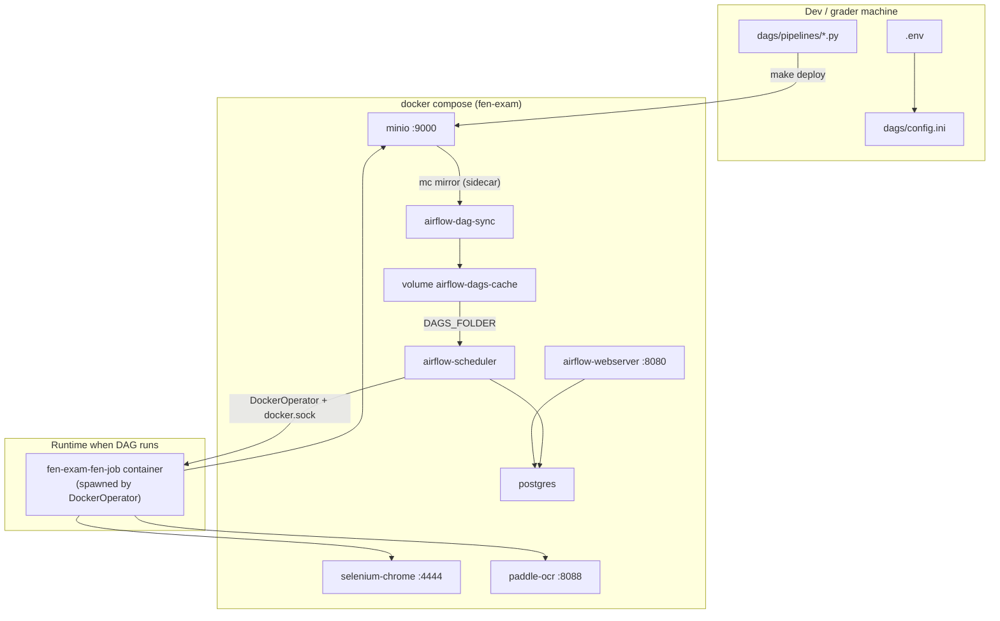
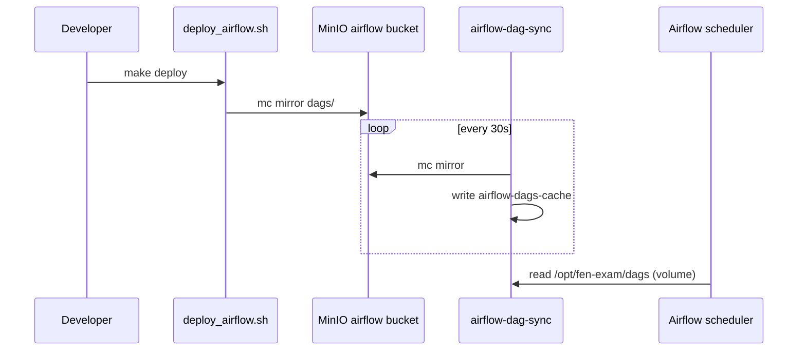
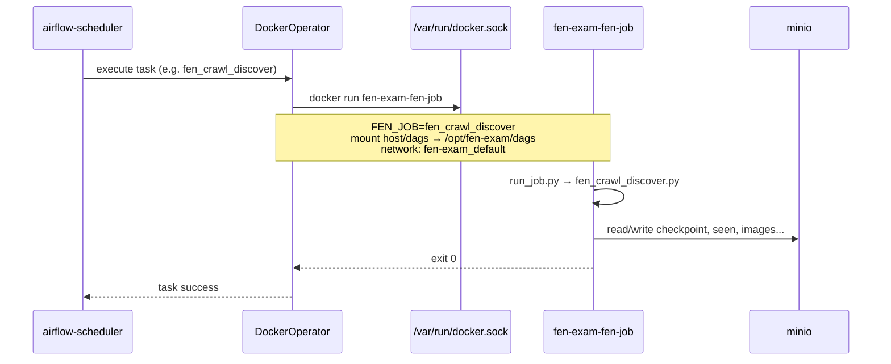
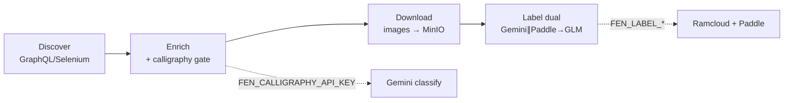

# FEN Exam Pipeline — Build, Deploy, and Run E2E

This document describes how to **build**, **deploy**, and **run end-to-end** the exam pipeline: crawl Facebook → calligraphy gate → download images → **label dual OCR**, entirely on **Docker Compose**.

**Primary OCR flow & output files:** see **[LABEL_DUAL_OUTPUT.md](LABEL_DUAL_OUTPUT.md)**.

---

## 1. Architecture overview



| Component | Role |
|-----------|------|
| **MinIO** | Object storage: crawl/OCR data + `airflow` bucket (DAG mirror) |
| **Postgres** | Airflow metadata (LocalExecutor) |
| **Airflow** | Orchestrator — reads DAGs from MinIO (sidecar sync) or `./dags` (dev) |
| **selenium-chrome** | Remote browser for Facebook crawl |
| **paddle-ocr** | Layout / auxiliary OCR (when the job needs it) |
| **fen-job image** | Python container that runs each stage (`FEN_JOB=...`) |

---

## DAG source for Airflow (`FEN_DAG_SOURCE`)

Default is **`minio`** (DAGs synced from the bucket via sidecar). Mode **`local`** uses a bind mount of `./dags` (fast for development).

| `FEN_DAG_SOURCE` | How it works | Commands |
|------------------|--------------|----------|
| `minio` (default) | `make deploy` → `airflow` bucket → sidecar `airflow-dag-sync` mirrors into volume → Airflow parses | `make bootstrap` / `make up` |
| `local` | Airflow reads `./dags` on the host directly | `FEN_DAG_SOURCE=local make bootstrap` or `make up-dev` |



**Note:** `fen-job` (DockerOperator) still mounts `FEN_HOST_PROJECT_DIR/dags` from the host to run jobs + `config.ini` — only Airflow’s **DAG parse** switches to MinIO when `FEN_DAG_SOURCE=minio`.

**Troubleshooting:** `No module named 'common'` usually means the sync volume is missing `jobs/common/` (no `mc` → deploy skipped, or sync not finished). Install `mc`, run `make deploy`, wait ~30s — or use `make up-dev` / `FEN_DAG_SOURCE=local`. Details: [USER_SETUP.md](USER_SETUP.md) §2, [LOCAL_SETUP_LOG.md](LOCAL_SETUP_LOG.md) §6.

After editing DAGs in `minio` mode:

```bash
make deploy    # upload to MinIO; sidecar sync within ~30s
```

---

## 2. Build phase

### 2.1 Configuration

```bash
cp .env.example .env
make configure    # wizard: FB + stage-separated API keys
```

Config flow:

```
.env  →  scripts/generate_config.sh  →  dags/config.ini
```

| `.env` variable | `config.ini` section | Purpose |
|-----------------|----------------------|---------|
| `FEN_CALLIGRAPHY_API_KEY` | `[fen_calligraphy]` | Calligraphy classification gate during enrich |
| `FEN_LABEL_GEMINI_API_KEY` | `[fen_label_gemini]` | Label dual — vision |
| `FEN_LABEL_GPT_API_KEY` | `[fen_label_gpt]` | Label dual — GPT |
| `FEN_LABEL_GLM_API_KEY` | `[fen_label_glm]` | Label dual — GLM / fuse_gt |
| `FEN_OCR_API_KEY` | `[fen_ocr]` | Legacy OCR only |
| `FEN_HOST_PROJECT_DIR` | `[docker] project_dir` | Absolute host path to the repo (DockerOperator bind mount) |
| `FB_USERNAME`, `FB_PASSWORD` | — | Facebook login (fb-login) |

### 2.2 Bootstrap (`make bootstrap`)

Runs in order:

| Step | Action | Result |
|------|--------|--------|
| 1 | `generate_config.sh` | Generate `dags/config.ini` from `.env` |
| 2 | `docker compose build` | Airflow image (with Docker CLI + provider) |
| 3 | `docker compose --profile job build fen-job` | Image `fen-exam-fen-job` |
| 4 | `up -d` minio, postgres, paddle-ocr, selenium-chrome | Infra ready |
| 5 | `minio-init` | Create buckets `airflow`, `final-exam-nlp-raw` |
| 6 | `deploy_airflow.sh` | Upload `dags/` to MinIO (before Airflow) |
| 7 | `airflow-dag-sync` (if `FEN_DAG_SOURCE=minio`) | Mirror MinIO → volume `airflow-dags-cache` |
| 8 | `airflow-init` → webserver + scheduler | Airflow UI at http://localhost:8080 (`admin` / `admin`) |

**Note:** With `FEN_DAG_SOURCE=minio`, Airflow reads DAGs from the sync volume (MinIO is source of truth). With `local`, Airflow reads the `./dags` bind mount — mirroring to MinIO still runs on `make deploy`, but Airflow does not use it for parse.

### 2.3 Images built

| Dockerfile | Image | Contents |
|------------|-------|----------|
| `docker/airflow/Dockerfile` | airflow (compose service) | Apache Airflow + `apache-airflow-providers-docker` |
| `docker/fen-job/Dockerfile` | `fen-exam-fen-job` | Python 3.12 + `dags/jobs` + `requirements.txt` |
| `docker/paddle-ocr/Dockerfile` | paddle-ocr | Paddle OCR HTTP service |

`fen-job` entrypoint:

```bash
python run_job.py   # read FEN_JOB from env → dispatch matching job
```

---

## 3. Deploy phase

Deploy has two layers.

### 3.1 Infra deploy (Compose)

```bash
make up          # compose + buckets + airflow-init + dag-sync (idempotent)
# or
make bootstrap   # build + up + deploy (first time)
```

All services join network `fen-exam_default`. `DockerOperator` uses `network_mode=fen-exam_default` so the job container can reach `http://minio:9000`, `http://selenium-chrome:4444/wd/hub`, etc.

### 3.2 DAG + config + jobs deploy

```bash
make deploy      # init-buckets + mirror DAGs + rebuild fen-job image
```

`scripts/deploy_airflow.sh` uses the MinIO client (`mc`) to mirror:

```
{dags}/  →  s3://airflow/dags/fen-exam/
```

Including `config.ini` (with API keys after `make configure`).

### 3.3 MinIO buckets

| Bucket | Purpose |
|--------|---------|
| `airflow` | DAG + config mirror |
| `final-exam-nlp-raw` | Pipeline data: crawl, images, export, OCR |

---

## 4. Job execution mechanism

The Airflow scheduler invokes `DockerOperator` via `dags/jobs/common/docker_executor.py`:



**Key points:**

1. The Airflow container mounts `/var/run/docker.sock` — the scheduler spawns job containers on the host Docker.
2. Bind mount `FEN_HOST_PROJECT_DIR/dags` — the job reads `config.ini` and the latest code.
3. Env `FEN_JOB` — job name dispatched in `run_job.py` (e.g. `fen_crawl_discover`, `fen_ocr`).

### Run a job manually (without Airflow)

```bash
make fb-login

# equivalent:
docker compose --profile job run --rm \
  -e FEN_JOB=fen_bootstrap_login \
  fen-job
```

---

## 5. E2E pipeline — data flow

### 5.1 Layout on MinIO

```
final-exam-nlp-raw/facebook/{group_id}/
├── crawl/
│   ├── checkpoint.json
│   ├── discover/
│   │   ├── seen_post_ids.json
│   │   └── batches/
│   ├── enrich/
│   ├── download/log.jsonl
│   └── state/cookies.json      ← after fb-login
├── export/
│   ├── valid_post.jsonl
│   └── invalid_post.jsonl
├── images/
└── ocr/
    └── label_dual_pilot/          ← label dual (B2)
        ├── task_b2.jsonl
        ├── task_b2.xlsx
        ├── summary.json
        ├── checkpoint.json
        ├── flags.jsonl
        ├── glm/recommend.jsonl    ← fuse_gt
        └── pages/…
```

Legacy (optional): `ocr/ocr_result.jsonl` from `fen_ocr_pipeline`.

### 5.2 Four main DAGs

#### `fen_e2e_pipeline` — simple E2E

```
branch_fb_login → (optional fb_login) → crawl_discover → crawl_enrich → crawl_download
  → resolve_ocr_batch → run_label_dual
```

- Params: `batch_target`, `ocr_limit` (default **0**), **`flush_posts` (default 5)**, `reset_crawl_data`, `run_fb_login`
- No rollover

#### `fen_crawl_pipeline` — full crawl

```
discover → enrich → download ─┬→ trigger_label_dual_batch (fen_label_dual_pipeline)
                               └→ should_continue? → cooldown → next batch
```

- Params: `batch_target`, `ocr_limit`, **`flush_posts`**, **`catch_bottom`**, …
- **`catch_bottom=true`**: rollover until `bottom_year`
- Label dual and rollover run **in parallel** after download

#### `fen_label_dual_pipeline` — B2 OCR only

```
run_fen_label_dual
```

- Output: `task_b2.jsonl`, `task_b2.xlsx`, `summary.json`, `glm/recommend.jsonl`
- Params: `label_limit`, `flush_posts`, `prepare_queues`, `glm`, `workers`

#### `fen_ocr_pipeline` — legacy

```
run_fen_ocr → run_fen_ocr_retry
```

- Only `ocr/ocr_result.jsonl` — not used for new B2

### 5.4 DAG parameter summary

| Param | DAG | Default | Meaning |
|-------|-----|---------|---------|
| `batch_target` | crawl, e2e | `10` | Target posts per **crawl** batch |
| `ocr_limit` / `label_limit` | label dual | `0` | Max pending **images**; `0` = full queue |
| **`flush_posts`** | label dual | **`5`** | Upsert jsonl every N **images** |
| `catch_bottom` | crawl | `true` | Rollover until `bottom_year` |
| `reset_crawl_data` | crawl, e2e | `false` | Clear crawl state (keep cookies) |
| `force` | label dual | `false` | Re-OCR completed images |
| `prepare_queues` | label dual | `true` | Build queues from valid_post |
| `glm` | label dual | `true` | Produce `fuse_gt` |

**Skip:** images that already have a page under `ocr/label_dual_pilot/pages/` (unless `force=true`).

**Upsert:** B2 by key `image`; B1 by `post_id`. Details: [LABEL_DUAL_OUTPUT.md](LABEL_DUAL_OUTPUT.md).

### 5.3 Per-stage business logic



| Stage | `FEN_JOB` | API / service | Input → Output |
|-------|-----------|---------------|----------------|
| Discover | `fen_crawl_discover` | — | FB group → post IDs |
| JSONL ingest | `fen_jsonl_ingest` | — | `seeds/input.jsonl` → discover batch (CDN probe) |
| Enrich | `fen_crawl_enrich` | `[fen_calligraphy]` | Post → valid/invalid jsonl |
| Download | `fen_crawl_download` | — | Valid → images on MinIO |
| **Label dual** | **`fen_label_dual`** | `[fen_label_*]` + Paddle | Images → `task_b2.jsonl` / xlsx |
| Legacy OCR | `fen_ocr` | `[fen_ocr]` | `ocr_result.jsonl` |

---

## 6. Run E2E from start to finish

### First time

```bash
git clone https://github.com/tuancaokaizen/hcmus_nlp_final_exam.git
cd hcmus_nlp_final_exam
git checkout main
git pull origin main
make configure
make bootstrap
make fb-login
```

### Daily test loop (3 steps)

```bash
# 1. Infrastructure
make up

# 2. After code changes
make deploy

# 3. Airflow UI — unpause DAG → Trigger with Configuration JSON
# http://localhost:8080 → fen_e2e_pipeline
```

Example trigger config for `fen_e2e_pipeline` (default `ocr_limit=0` — OCR full queue after crawl):

```json
{
  "batch_target": 10,
  "reset_crawl_data": true
}
```

To limit OCR posts (smoke test): `"ocr_limit": 5`.

Example `fen_crawl_pipeline` (auto OCR — full batch queue, no `ocr_limit` needed):

```json
{
  "batch_target": 10,
  "reset_crawl_data": true
}
```

(`catch_bottom` defaults to `true` — omit the field if you want catch-bottom / rollover)

```bash
make verify
```

### What does verify check?

`scripts/verify_e2e.sh` uses `mc` stat on MinIO:

| Artifact | Meaning |
|----------|---------|
| `crawl/checkpoint.json` | Crawl has run; has cursor/batch |
| `crawl/discover/seen_post_ids.json` | Dedup post IDs |
| `export/valid_post.jsonl` | Posts that passed the gate |
| `ocr/label_dual_pilot/task_b2.jsonl` | Label dual B2 (if already run) |
| `ocr/label_dual_pilot/summary.json` | Label dual run metrics |

---

## 7. Makefile — common commands

| Command | Description |
|---------|-------------|
| `make configure` | Wizard for `.env` + generate `config.ini` |
| `make config` | Only regenerate `config.ini` from `.env` |
| `make sync` | Sync/transform job code (optional, when a sync source exists) |
| `make build` | Build all images (including `fen-job`) |
| `make up` | `scripts/up.sh`: compose + buckets + Airflow init + DAG sync |
| `make down` | Stop the stack; **keep** volumes (MinIO data, Postgres, …) |
| `make down-v` | Stop the stack; **delete** all named volumes (`down -v`) |
| `make up-dev` | Bind-mount `./dags` only (no sidecar) |
| `make bootstrap` | Full setup: config → build → up → buckets → Airflow → deploy |
| `make deploy` | Init buckets + mirror DAGs to MinIO + rebuild `fen-job` |
| `make fb-login` | Save FB cookies to MinIO |
| `make verify` | Check E2E artifacts on MinIO |

---

## 8. Demo limits (`.env`)

| Variable | Default | Meaning |
|----------|---------|---------|
| `FEN_BATCH_TARGET` | `10` | Target **new** posts per crawl / JSONL batch |
| `FEN_OCR_LIMIT` | `0` | Cap label-dual **images** when running via env; `0` = entire queue (matches DAG default) |
| `FEN_CATCH_BOTTOM` | `true` | Hint in `.env`; DAG param `catch_bottom` on `fen_crawl_pipeline` only |
| `FEN_DEMO_MODE` | `false` | Deprecated — use `catch_bottom=false` |

**Label dual skip:** images that already have a page under `ocr/label_dual_pilot/pages/` are skipped unless `force=true`. DAG param **`ocr_limit` / `label_limit`** = max pending **images** (`0` = no cap). See [LABEL_DUAL_OUTPUT.md](LABEL_DUAL_OUTPUT.md) and [CRAWL_STATE.md](CRAWL_STATE.md).

Legacy `fen_ocr_pipeline` / `ocr/ocr_result.jsonl` is optional only — not the B2 path.

**Qdrant:** not used in the exam stack — label dual / OCR write only to MinIO.

---

## 9. Stack lifecycle: `up` / `down` / `down-v`

### Named volumes (docker compose)

| Volume | Contents |
|--------|----------|
| `minio-data` | Buckets `airflow`, `final-exam-nlp-raw` (crawl, images, OCR, cookies) |
| `postgres-data` | Airflow metadata |
| `selenium-profile` | Chrome profile (FB session) |
| `airflow-dags-cache` | DAG mirror from MinIO (`FEN_DAG_SOURCE=minio` mode) |

### Commands

| Command | Containers | Volumes | Files in the repo |
|---------|------------|---------|-------------------|
| `make up` | Start + full env init | Keep (or create on first run) | Untouched |
| `make down` | Stop & remove containers | **Keep** | Untouched |
| `make down-v` | Stop & remove containers | **Delete all** | Untouched |

After `make down` → `make up`: continue with existing data (checkpoint, cookies if still present).

After `make down-v` → `make up`: clean environment — run `make fb-login` again and crawl from scratch.

```bash
# Reset all pipeline data (does not delete source code)
make down-v
make up
make fb-login
```

**Not deleted by `down` / `down-v`:** Docker images, `.env`, `dags/config.ini`, source code in the repo.

---

## 10. Operational notes

1. **`FEN_HOST_PROJECT_DIR`** must be an absolute path on the host. Bootstrap/configure set it automatically; if wrong, DockerOperator cannot mount `config.ini`.

2. **Rebuild `fen-job`** after changing job code:
   ```bash
   docker compose --profile job build fen-job
   ```

3. **API keys are stage-separated**:
   - Missing `FEN_CALLIGRAPHY_API_KEY` → enrich gate fails.
   - Missing `FEN_LABEL_*` → label dual fails.
   - `FEN_OCR_API_KEY` is only for legacy `fen_ocr`.

4. **Selenium** is required for live Facebook crawl. The minimal stack (`docker-compose.minimal.yml`) omits Selenium — use only when you have sample data / replay.

5. **DAG paused at creation** — after bootstrap, unpause the DAG in the Airflow UI before triggering.

6. **`make down` vs `make down-v`** — `down` keeps data; `down-v` deletes volumes. Details: README and section 9.

6. **After editing DAG Python** — restart the scheduler or wait for Airflow reload; after editing job code — rebuild the `fen-job` image.

---

## Credentials (Docker defaults)

Defaults for easy local use:

| Service | URL | User | Password |
|---------|-----|------|----------|
| Airflow UI | http://localhost:8080 | `admin` | `admin` |
| MinIO console | http://localhost:9001 | `admin` | `admin1234` |
| Postgres (internal) | `postgres:5432` | `admin` | `admin` |
| MinIO API (in `config.ini`) | `access_key` / `secret_key` | `admin` | `admin` |

Facebook (`FB_USERNAME` / `FB_PASSWORD`) is still filled in by the user — unrelated to Docker.

---

## 11. Related docs

- [LABEL_DUAL_OUTPUT.md](LABEL_DUAL_OUTPUT.md) — B2 files, upsert, flush
- [USER_SETUP.md](USER_SETUP.md) — detailed setup guide
- [CRAWL_STATE.md](CRAWL_STATE.md) — checkpoint, seen, export paths
- [GRADER_GUIDE.md](GRADER_GUIDE.md) — grading checklist
- [PROPOSAL_DOCKER_EXAM_PIPELINE.md](PROPOSAL_DOCKER_EXAM_PIPELINE.md) — original design proposal
