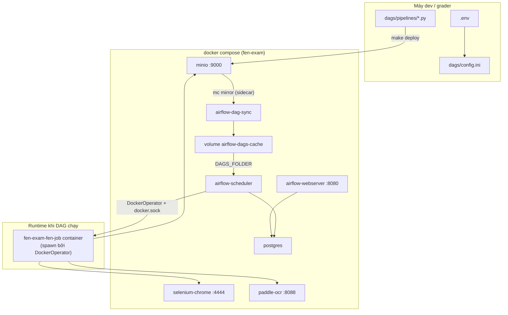
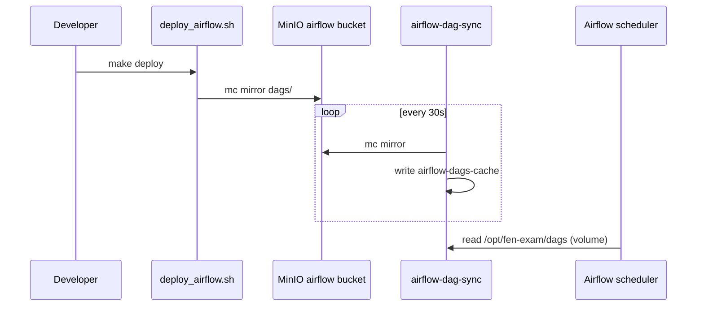
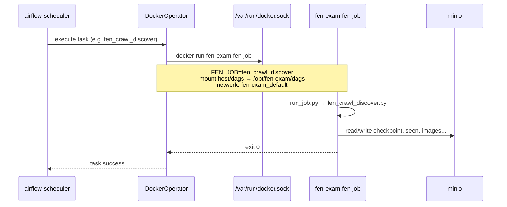
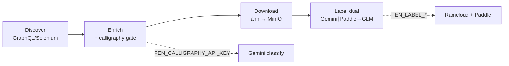

# FEN Exam Pipeline — Dựng, Deploy và Chạy E2E

Tài liệu mô tả cơ chế **build**, **deploy** và **chạy end-to-end** của pipeline exam: crawl Facebook → calligraphy gate → download ảnh → **label dual OCR**, chạy hoàn toàn trên **Docker Compose**.

**Luồng OCR chính & file output:** xem **[LABEL_DUAL_OUTPUT.md](LABEL_DUAL_OUTPUT.md)**.

---

## 1. Tổng quan kiến trúc



| Thành phần | Vai trò |
|------------|---------|
| **MinIO** | Object storage: data crawl/OCR + bucket `airflow` (mirror DAG) |
| **Postgres** | Metadata Airflow (LocalExecutor) |
| **Airflow** | Orchestrator — đọc DAG từ MinIO (sidecar sync) hoặc `./dags` (dev) |
| **selenium-chrome** | Browser remote cho crawl Facebook |
| **paddle-ocr** | OCR layout/phụ trợ (khi job cần) |
| **fen-job image** | Container Python chạy từng stage (`FEN_JOB=...`) |

---

## Nguồn DAG cho Airflow (`FEN_DAG_SOURCE`)

Mặc định **`minio`** (prod-like). Chế độ **`local`** dùng bind mount `./dags` (dev nhanh).

| `FEN_DAG_SOURCE` | Cách hoạt động | Lệnh |
|------------------|----------------|------|
| `minio` (default) | `make deploy` → bucket `airflow` → sidecar `airflow-dag-sync` mirror vào volume → Airflow parse | `make bootstrap` / `make up` |
| `local` | Airflow đọc trực tiếp `./dags` trên host | `FEN_DAG_SOURCE=local make bootstrap` hoặc `make up-dev` |



**Lưu ý:** `fen-job` (DockerOperator) vẫn mount `FEN_HOST_PROJECT_DIR/dags` từ host để chạy job + `config.ini` — chỉ **parse DAG** của Airflow chuyển sang MinIO khi `FEN_DAG_SOURCE=minio`.

Sau khi sửa DAG ở chế độ `minio`:

```bash
make deploy    # upload lên MinIO; sidecar sync trong ~30s
```

---

## 2. Phase dựng (Build)

### 2.1 Cấu hình

```bash
cp .env.example .env
make configure    # wizard: FB + API keys tách theo stage
```

Luồng config:

```
.env  →  scripts/generate_config.sh  →  dags/config.ini
```

| Biến `.env` | Section `config.ini` | Mục đích |
|-------------|----------------------|----------|
| `FEN_CALLIGRAPHY_API_KEY` | `[fen_calligraphy]` | Gate phân loại thư pháp khi enrich |
| `FEN_LABEL_GEMINI_API_KEY` | `[fen_label_gemini]` | Label dual — vision |
| `FEN_LABEL_GPT_API_KEY` | `[fen_label_gpt]` | Label dual — GPT |
| `FEN_LABEL_GLM_API_KEY` | `[fen_label_glm]` | Label dual — GLM / fuse_gt |
| `FEN_OCR_API_KEY` | `[fen_ocr]` | Legacy OCR only |
| `FEN_HOST_PROJECT_DIR` | `[docker] project_dir` | Đường dẫn tuyệt đối repo trên host (bind mount DockerOperator) |
| `FB_USERNAME`, `FB_PASSWORD` | — | Đăng nhập Facebook (fb-login) |

### 2.2 Bootstrap (`make bootstrap`)

Chạy tuần tự:

| Bước | Hành động | Kết quả |
|------|-----------|---------|
| 1 | `generate_config.sh` | Sinh `dags/config.ini` từ `.env` |
| 2 | `docker compose build` | Image Airflow (có Docker CLI + provider) |
| 3 | `docker compose --profile job build fen-job` | Image `fen-exam-fen-job` |
| 4 | `up -d` minio, postgres, paddle-ocr, selenium-chrome | Infra sẵn sàng |
| 5 | `minio-init` | Tạo bucket `airflow`, `final-exam-nlp-raw` |
| 6 | `deploy_airflow.sh` | Upload `dags/` lên MinIO (trước Airflow) |
| 7 | `airflow-dag-sync` (nếu `FEN_DAG_SOURCE=minio`) | Mirror MinIO → volume `airflow-dags-cache` |
| 8 | `airflow-init` → webserver + scheduler | Airflow UI tại http://localhost:8080 (`admin` / `admin`) |

**Lưu ý:** Với `FEN_DAG_SOURCE=minio`, Airflow đọc DAG từ volume sync (MinIO là source of truth). Với `local`, Airflow đọc bind mount `./dags` — mirror lên MinIO vẫn chạy khi `make deploy` nhưng Airflow không dùng cho parse.

### 2.3 Images được build

| Dockerfile | Image | Nội dung |
|------------|-------|----------|
| `docker/airflow/Dockerfile` | airflow (compose service) | Apache Airflow + `apache-airflow-providers-docker` |
| `docker/fen-job/Dockerfile` | `fen-exam-fen-job` | Python 3.12 + `dags/jobs` + `requirements.txt` |
| `docker/paddle-ocr/Dockerfile` | paddle-ocr | Paddle OCR HTTP service |

Entrypoint `fen-job`:

```bash
python run_job.py   # đọc FEN_JOB từ env → dispatch job tương ứng
```

---

## 3. Phase deploy

Deploy có hai lớp.

### 3.1 Infra deploy (Compose)

```bash
make up          # compose + buckets + airflow-init + dag-sync (idempotent)
# hoặc
make bootstrap   # build + up + deploy (first time)
```

Tất cả services join network `fen-exam_default`. `DockerOperator` dùng `network_mode=fen-exam_default` để container job gọi được `http://minio:9000`, `http://selenium-chrome:4444/wd/hub`, v.v.

### 3.2 DAG + config + jobs deploy

```bash
make deploy      # init-buckets + mirror DAGs + rebuild fen-job image
```

`scripts/deploy_airflow.sh` dùng MinIO client (`mc`) mirror:

```
{dags}/  →  s3://airflow/dags/fen-exam/
```

Kèm file `config.ini` (đã có API keys sau `make configure`).

### 3.3 Buckets MinIO

| Bucket | Mục đích |
|--------|----------|
| `airflow` | Mirror DAG + config |
| `final-exam-nlp-raw` | Data pipeline: crawl, images, export, OCR |

---

## 4. Cơ chế chạy job

Airflow scheduler gọi `DockerOperator` qua `dags/jobs/common/docker_executor.py`:



**Điểm then chốt:**

1. Airflow container mount `/var/run/docker.sock` — scheduler spawn container job trên host Docker.
2. Bind mount `FEN_HOST_PROJECT_DIR/dags` — job đọc `config.ini` và code mới nhất.
3. Biến `FEN_JOB` — tên job dispatch trong `run_job.py` (vd. `fen_crawl_discover`, `fen_ocr`).

### Chạy job thủ công (không qua Airflow)

```bash
make fb-login

# tương đương:
docker compose --profile job run --rm \
  -e FEN_JOB=fen_bootstrap_login \
  fen-job
```

---

## 5. Pipeline E2E — luồng dữ liệu

### 5.1 Layout trên MinIO

```
final-exam-nlp-raw/facebook/{group_id}/
├── crawl/
│   ├── checkpoint.json
│   ├── discover/
│   │   ├── seen_post_ids.json
│   │   └── batches/
│   ├── enrich/
│   ├── download/log.jsonl
│   └── state/cookies.json      ← sau fb-login
├── export/
│   ├── valid_post.jsonl
│   └── invalid_post.jsonl
├── images/
└── ocr/
    └── label_dual_pilot/          ← label dual (B2)
        ├── task_b2.jsonl
        ├── task_b2.xlsx
        ├── summary.json
        ├── checkpoint.json
        ├── flags.jsonl
        ├── glm/recommend.jsonl    ← fuse_gt
        └── pages/…
```

Legacy (optional): `ocr/ocr_result.jsonl` từ `fen_ocr_pipeline`.

### 5.2 Bốn DAG chính

#### `fen_e2e_pipeline` — E2E đơn giản

```
branch_fb_login → (optional fb_login) → crawl_discover → crawl_enrich → crawl_download
  → resolve_ocr_batch → run_label_dual
```

- Params: `batch_target`, `ocr_limit` (default **0**), **`flush_posts` (default 5)**, `reset_crawl_data`, `run_fb_login`
- Không rollover

#### `fen_crawl_pipeline` — crawl đầy đủ

```
discover → enrich → download ─┬→ trigger_label_dual_batch (fen_label_dual_pipeline)
                               └→ should_continue? → cooldown → batch tiếp
```

- Params: `batch_target`, `ocr_limit`, **`flush_posts`**, **`catch_bottom`**, …
- **`catch_bottom=true`**: rollover đến `bottom_year`
- Label dual và rollover **song song** sau download

#### `fen_label_dual_pipeline` — OCR B2 riêng

```
run_fen_label_dual
```

- Output: `task_b2.jsonl`, `task_b2.xlsx`, `summary.json`, `glm/recommend.jsonl`
- Params: `label_limit`, `flush_posts`, `prepare_queues`, `glm`, `workers`

#### `fen_ocr_pipeline` — legacy

```
run_fen_ocr → run_fen_ocr_retry
```

- Chỉ `ocr/ocr_result.jsonl` — không dùng cho B2 mới

### 5.4 Bảng tham số DAG (tóm tắt)

| Param | DAG | Default | Ý nghĩa |
|-------|-----|---------|---------|
| `batch_target` | crawl, e2e | `10` | Số post mục tiêu mỗi batch **crawl** |
| `ocr_limit` / `label_limit` | label dual | `0` | Tối đa **ảnh** pending; `0` = full queue |
| **`flush_posts`** | label dual | **`5`** | Upsert jsonl mỗi N **ảnh** |
| `catch_bottom` | crawl | `true` | Rollover đến `bottom_year` |
| `reset_crawl_data` | crawl, e2e | `false` | Xóa state crawl (giữ cookies) |
| `force` | label dual | `false` | OCR lại ảnh đã xong |
| `prepare_queues` | label dual | `true` | Tạo queue từ valid_post |
| `glm` | label dual | `true` | Sinh `fuse_gt` |

**Skip:** ảnh đã có page trong `ocr/label_dual_pilot/pages/` (trừ `force=true`).

**Upsert:** B2 theo key `image`; B1 theo `post_id`. Chi tiết: [LABEL_DUAL_OUTPUT.md](LABEL_DUAL_OUTPUT.md).

### 5.3 Logic nghiệp vụ từng stage



| Stage | `FEN_JOB` | API / service | Input → Output |
|-------|-----------|---------------|----------------|
| Discover | `fen_crawl_discover` | — | FB group → post IDs |
| Enrich | `fen_crawl_enrich` | `[fen_calligraphy]` | Post → valid/invalid jsonl |
| Download | `fen_crawl_download` | — | Valid → ảnh MinIO |
| **Label dual** | **`fen_label_dual`** | `[fen_label_*]` + Paddle | Ảnh → `task_b2.jsonl` / xlsx |
| Legacy OCR | `fen_ocr` | `[fen_ocr]` | `ocr_result.jsonl` |

---

## 6. Chạy E2E từ đầu đến cuối

### Lần đầu

```bash
git clone https://github.com/tuancaokaizen/hcmus_nlp_final_exam.git
cd hcmus_nlp_final_exam
git checkout main
git pull origin main
make configure
make bootstrap
make fb-login
```

### Vòng test hàng ngày (3 bước)

```bash
# 1. Hạ tầng
make up

# 2. Sau khi sửa code
make deploy

# 3. Airflow UI — unpause DAG → Trigger với Configuration JSON
# http://localhost:8080 → fen_e2e_pipeline
```

Ví dụ config trigger `fen_e2e_pipeline` (mặc định `ocr_limit=0` — OCR full queue sau crawl):

```json
{
  "batch_target": 10,
  "reset_crawl_data": true
}
```

Để giới hạn post OCR (smoke test): `"ocr_limit": 5`.

Ví dụ `fen_crawl_pipeline` (OCR auto — full batch queue, không cần `ocr_limit`):

```json
{
  "batch_target": 10,
  "reset_crawl_data": true
}
```

(`catch_bottom` mặc định `true` — bỏ qua field nếu muốn bắt đáy / rollover)

```bash
make verify
```

### Verify kiểm tra gì?

`scripts/verify_e2e.sh` dùng `mc` stat trên MinIO:

| Artifact | Ý nghĩa |
|----------|---------|
| `crawl/checkpoint.json` | Crawl đã chạy, có cursor/batch |
| `crawl/discover/seen_post_ids.json` | Dedup post IDs |
| `export/valid_post.jsonl` | Có post qua gate |
| `ocr/label_dual_pilot/task_b2.jsonl` | Label dual B2 (nếu đã chạy) |
| `ocr/label_dual_pilot/summary.json` | Chỉ số run label dual |

---

## 7. Makefile — lệnh thường dùng

| Lệnh | Mô tả |
|------|-------|
| `make configure` | Wizard `.env` + sinh `config.ini` |
| `make config` | Chỉ regenerate `config.ini` từ `.env` |
| `make sync` | Copy/transform jobs từ upstream repo |
| `make build` | Build tất cả images (gồm `fen-job`) |
| `make up` | `scripts/up.sh`: compose + buckets + Airflow init + DAG sync |
| `make down` | Dừng stack; **giữ** volumes (data MinIO, Postgres, …) |
| `make down-v` | Dừng stack; **xóa** tất cả named volumes (`down -v`) |
| `make up-dev` | Chỉ bind mount `./dags` (không sidecar) |
| `make bootstrap` | Full setup: config → build → up → buckets → Airflow → deploy |
| `make deploy` | Init buckets + mirror DAGs lên MinIO + rebuild `fen-job` |
| `make fb-login` | Lưu cookie FB lên MinIO |
| `make verify` | Kiểm tra artifact E2E trên MinIO |

---

## 8. Demo limits (`.env`)

| Biến | Mặc định | Ý nghĩa |
|------|----------|---------|
| `FEN_BATCH_TARGET` | `10` | Số post mục tiêu mỗi batch crawl |
| `FEN_OCR_LIMIT` | `0` | Cap post OCR khi chạy job qua env; `0` = hết queue (trùng default DAG) |
| `FEN_CATCH_BOTTOM` | `true` | Gợi ý trong `.env`; DAG param `catch_bottom` trên `fen_crawl_pipeline` |
| `FEN_DEMO_MODE` | `false` | Deprecated — dùng `catch_bottom=false` |

**OCR skip:** ảnh đã có trong `ocr_result.jsonl` được bỏ qua (trừ `force=true`). `ocr_limit` giới hạn **số post** trong queue, không phải số ảnh.

**Qdrant:** không dùng trong exam stack — OCR/retry chỉ ghi MinIO.

---

## 9. Vòng đời stack: `up` / `down` / `down-v`

### Named volumes (docker compose)

| Volume | Nội dung |
|--------|----------|
| `minio-data` | Bucket `airflow`, `final-exam-nlp-raw` (crawl, ảnh, OCR, cookies) |
| `postgres-data` | Metadata Airflow |
| `selenium-profile` | Chrome profile (session FB) |
| `airflow-dags-cache` | DAG mirror từ MinIO (chế độ `FEN_DAG_SOURCE=minio`) |

### Lệnh

| Lệnh | Container | Volumes | File trên repo |
|------|-----------|---------|----------------|
| `make up` | Bật + init đủ môi trường | Giữ (hoặc tạo mới lần đầu) | Không đụng |
| `make down` | Tắt & xóa container | **Giữ** | Không đụng |
| `make down-v` | Tắt & xóa container | **Xóa hết** | Không đụng |

Sau `make down` → `make up`: tiếp tục với data cũ (checkpoint, cookies nếu còn).

Sau `make down-v` → `make up`: môi trường sạch — cần `make fb-login` lại và crawl từ đầu.

```bash
# Reset toàn bộ data pipeline (không xóa source code)
make down-v
make up
make fb-login
```

**Không xóa bởi `down` / `down-v`:** Docker images, `.env`, `dags/config.ini`, code trong repo.

---

## 10. Lưu ý vận hành

1. **`FEN_HOST_PROJECT_DIR`** phải là path tuyệt đối trên host. Bootstrap/configure tự set; nếu sai, DockerOperator không mount được `config.ini`.

2. **Rebuild `fen-job`** sau khi sửa code job:
   ```bash
   docker compose --profile job build fen-job
   ```

3. **API keys tách stage**:
   - Thiếu `FEN_CALLIGRAPHY_API_KEY` → enrich gate fail.
   - Thiếu `FEN_LABEL_*` → label dual fail.
   - `FEN_OCR_API_KEY` chỉ cho legacy `fen_ocr`.

4. **Selenium** cần cho crawl Facebook live. Stack minimal (`docker-compose.minimal.yml`) bỏ Selenium — chỉ dùng khi có sample data / replay.

5. **DAG paused at creation** — sau bootstrap, unpause DAG trên Airflow UI trước khi trigger.

6. **`make down` vs `make down-v`** — `down` giữ data; `down-v` xóa volumes. Chi tiết: README và mục 9.

6. **Sau sửa DAG Python** — restart scheduler hoặc đợi Airflow reload; sau sửa job code — rebuild `fen-job` image.

---

## Credentials mặc định (Docker)

Tất cả dùng **`admin` / `admin`** cho dễ nhớ:

| Service | URL | User | Password |
|---------|-----|------|----------|
| Airflow UI | http://localhost:8080 | `admin` | `admin` |
| MinIO console | http://localhost:9001 | `admin` | `admin` |
| Postgres (nội bộ) | `postgres:5432` | `admin` | `admin` |
| MinIO API (trong `config.ini`) | `access_key` / `secret_key` | `admin` | `admin` |

Facebook (`FB_USERNAME` / `FB_PASSWORD`) vẫn do user tự điền — không liên quan Docker.

---

## 11. Tài liệu liên quan

- [LABEL_DUAL_OUTPUT.md](LABEL_DUAL_OUTPUT.md) — file B2, upsert, flush
- [USER_SETUP.md](USER_SETUP.md) — hướng dẫn cài đặt chi tiết
- [CRAWL_STATE.md](CRAWL_STATE.md) — checkpoint, seen, export paths
- [GRADER_GUIDE.md](GRADER_GUIDE.md) — checklist chấm bài
- [PROPOSAL_DOCKER_EXAM_PIPELINE.md](PROPOSAL_DOCKER_EXAM_PIPELINE.md) — đề xuất thiết kế ban đầu
