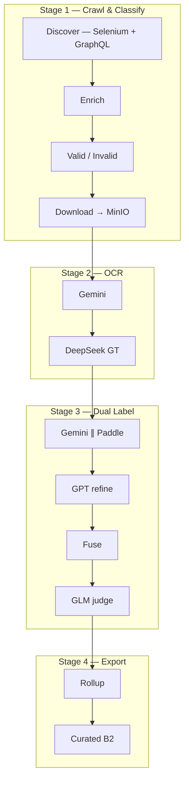
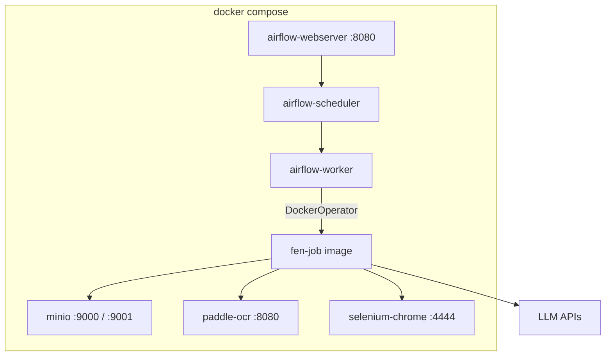

# Đề xuất: NLP Final Exam Pipeline — Docker Compose

> **Vận hành hiện tại:** [`README.md`](../README.md), [`USER_SETUP.md`](USER_SETUP.md), [`LABEL_DUAL_OUTPUT.md`](LABEL_DUAL_OUTPUT.md), [`PIPELINE_BUILD_DEPLOY_RUN.md`](PIPELINE_BUILD_DEPLOY_RUN.md) — luồng chính **label dual** (`task_b2.jsonl`, `flush_posts=5`). File này là proposal thiết kế ban đầu.

> **Mục đích:** Đề xuất kiến trúc repo `implement_nlp_pipeline_for_exam` cho **người chấm đồ án**.  
> Copy **cùng logic pipeline** từ repo processing upstream, deploy **một mode duy nhất: Docker Compose**  
> (Airflow + MinIO + Paddle + Selenium).

**Phiên bản:** `v0.2-proposal`  
**Ngày:** 2026-08-31  
**Repo nguồn:** `implement_ocr_pipeline` (upstream — set `UPSTREAM_ROOT` khi sync)  
**Repo đích:** `features/implement_nlp_pipeline_for_exam`

---

## 1. Tóm tắt

### 1.1 Vấn đề

Pipeline gốc chạy trên K3s — người chấm khó reproduce. Cần repo exam **tự chứa**, `docker compose up` là chạy được.

### 1.2 Giải pháp — **1 mode Docker**

| Thành phần | Docker service |
|------------|----------------|
| Orchestration | `airflow-webserver` + `airflow-scheduler` + `airflow-worker` |
| Object storage | `minio` |
| OCR nhánh B | `paddle-ocr` (FastAPI, build từ Dockerfile) |
| Crawl GraphQL | `selenium-chrome` |
| Job runner | `fen-job` container (gọi `run_k8s_job.py`) |
| LLM | API ngoài (Gemini / GPT / DeepSeek / GLM) — keys trong `.env` |

**Không dùng K3s / kubectl** trong repo exam. Logic nghiệp vụ giữ nguyên; chỉ thay lớp orchestration:

| Production (K3s) | Exam (Docker) |
|------------------|---------------|
| `KubernetesPodOperator` | `DockerOperator` hoặc `BashOperator` → `docker compose run fen-job` |
| In-cluster DNS `minio.storage.svc` | `http://minio:9000` |
| Paddle StatefulSet | `paddle-ocr:8080` |
| PVC python cache | Named volume `fen-python-deps` |
| `deploy_airflow.sh` upload MinIO | Volume mount `./dags` + optional sync bucket `airflow` |

---

## 2. Pipeline nghiệp vụ (giữ nguyên logic)

### 2.1 Flow



### 2.2 GraphQL trong crawl — **Có**

```
Selenium (cookies FB) → scroll feed → bắt GraphQL (CDP)
  → replay GroupsCometFeedRegularStoriesPaginationQuery
  → parse caption/images → enrich permalink nếu thiếu → download CDN → MinIO
```

Code: `final_exam_nlp_v5_discover.py`, `final_exam_nlp_graphql_batch.py`, `final_exam_nlp_v5_enrich.py`

**Cho người chấm:** ship `sample_data/` để skip crawl khi không có cookies FB.

### 2.3 DAG ↔ Job ↔ MinIO

| Stage | DAG | `FEN_JOB` | Output MinIO |
|-------|-----|-----------|--------------|
| Crawl | `final_exam_nlp_crawl_pipeline` | `v5_discover/enrich/download` | `valid_post.jsonl`, `images/` |
| OCR | `final_exam_nlp_ocr_pipeline` | `final_exam_nlp_ocr` | `ocr_result.jsonl` |
| Label dual | `final_exam_nlp_ocr_label_dual_pipeline` | `final_exam_nlp_ocr_label_dual` | `task_b2.jsonl` |
| GLM | `final_exam_nlp_gt_confidence_judge_pipeline` | `gt_confidence_judge` | `glm/recommend.jsonl` |
| Rollup | `final_exam_nlp_consensus_rollup_pipeline` | `consensus_rollup` | `consensus_rollup.jsonl` |
| Curated | script/DAG mới | `hitl_curated_export` | `selected_hitl_pass_b2.*` |

Bucket: `final-exam-nlp-raw` · Prefix: `facebook/{group_id}/`

---

## 3. Kiến trúc Docker Compose

### 3.1 Sơ đồ



### 3.2 `docker-compose.yml` (services)

| Service | Image | Port | Ghi chú |
|---------|-------|------|---------|
| `minio` | `minio/minio` | 9000, 9001 | Bucket `final-exam-nlp-raw` + `airflow` |
| `postgres` | `postgres:15` | — | Airflow metadata DB |
| `airflow-init` | `fen-airflow` | — | migrate + create admin |
| `airflow-webserver` | `fen-airflow` | 8080 | UI |
| `airflow-scheduler` | `fen-airflow` | — | |
| `airflow-worker` | `fen-airflow` | — | CeleryExecutor hoặc LocalExecutor |
| `paddle-ocr` | `fen-paddle-ocr` | 8080 | CPU default; GPU qua `deploy.resources` |
| `selenium-chrome` | `selenium/standalone-chrome` | 4444 | GraphQL crawl |
| `fen-job` | `fen-job` | — | `profiles: [job]` — không auto-start |

Volumes: `minio-data`, `fen-python-deps`, `selenium-profile` (cookies)

### 3.3 Thay `KubernetesPodOperator`

Tạo `dags/jobs/common/docker_executor.py`:

```python
# Airflow task gọi:
# docker compose run --rm -e FEN_JOB=fen_ocr fen-job
```

Hoặc mount Docker socket vào worker (`/var/run/docker.sock`) để `DockerOperator` spawn `fen-job` container cùng network `compose_default`.

Env trong job container:
```
FEN_RUNTIME=docker
FEN_MINIO_ENDPOINT=http://minio:9000
PADDLE_SERVICE_URL=http://paddle-ocr:8080
SELENIUM_REMOTE_URL=http://selenium-chrome:4444/wd/hub
```

### 3.4 Docker images cần build

| Image | Dockerfile | Nội dung |
|-------|------------|----------|
| `fen-paddle-ocr` | `docker/paddle-ocr/Dockerfile` | Copy từ upstream `services/paddle_ocr/` |
| `fen-airflow` | `docker/airflow/Dockerfile` | `apache/airflow:2.10.5` + `requirements.txt` + DAGs |
| `fen-job` | `docker/fen-job/Dockerfile` | Python 3.12 + jobs + entrypoint `run_k8s_job.py` |

---

## 4. Cấu trúc repo

```
implement_nlp_pipeline_for_exam/
├── README.md
├── .env.example
├── docker-compose.yml
├── docker-compose.minimal.yml    # MinIO + Airflow + Paddle (không Selenium)
├── Makefile                      # make up | down | down-v | deploy | verify | …
│
├── docker/
│   ├── airflow/Dockerfile
│   ├── fen-job/Dockerfile
│   └── paddle-ocr/Dockerfile
│
├── dags/
│   ├── config.ini.example
│   ├── requirements.txt
│   ├── pipelines/                # subset FEN DAGs (docker executor)
│   └── jobs/                     # sync từ upstream
│
├── scripts/
│   ├── bootstrap.sh              # cp .env, build images, compose up
│   ├── load_sample_data.sh
│   ├── trigger_demo.sh
│   └── verify_pipeline.sh
│
├── sample_data/
│   ├── minio_seed/
│   └── expected/
│
├── docs/
│   ├── PROPOSAL_DOCKER_EXAM_PIPELINE.md
│   └── GRADER_GUIDE.md
│
└── tests/
```

**Không có thư mục `k8s/`** trong repo exam.

---

## 5. Cấu hình `.env.example`

```bash
MINIO_ROOT_USER=admin
MINIO_ROOT_PASSWORD=admin
FEN_BUCKET_RAW=final-exam-nlp-raw
FEN_MINIO_ENDPOINT=http://minio:9000
FEN_GROUP_ID=322453387859386
PADDLE_SERVICE_URL=http://paddle-ocr:8080
SELENIUM_REMOTE_URL=http://selenium-chrome:4444/wd/hub

RAMCLOUDS_API_KEY=
RAMCLOUDS_BASE_URL=https://ramclouds.me/v1

FEN_RUNTIME=docker
AIRFLOW_UID=50000
```

`scripts/bootstrap.sh` generate `dags/config.ini` từ `.env`.

---

## 6. Luồng chấm đồ án

### Quick demo (~15 phút, không cần API key / FB)

```bash
git clone ... && cd implement_nlp_pipeline_for_exam
cp .env.example .env
make up-minimal
make load-sample
make trigger-demo
make verify
```

### Full pipeline (có API keys + cookies FB)

```bash
git clone https://github.com/tuancaokaizen/hcmus_nlp_final_exam.git
cd hcmus_nlp_final_exam
git checkout main
cp .env.example .env
make configure && make up && make fb-login
# Airflow UI http://localhost:8080 — unpause DAG → trigger
# See README.md for trigger JSON (batch_target, ocr_limit, flush_posts)
make verify
```

---

## 7. Yêu cầu máy chấm

| Resource | Tối thiểu | Khuyến nghị |
|----------|-----------|-------------|
| CPU | 4 cores | 8 cores |
| RAM | 16 GB | 32 GB |
| Disk | 50 GB | 100 GB |
| Docker | 24.0+ | + Compose v2 |
| GPU | Không bắt buộc | 1× NVIDIA (Paddle nhanh hơn) |

---

## 8. Kế hoạch triển khai

| Phase | Việc | Thời gian |
|-------|------|-----------|
| 0 | `docker-compose.yml`, Dockerfiles, `Makefile`, `bootstrap.sh` | 1–2 ngày |
| 1 | Sync `dags/jobs` + docker executor adapter | 2–3 ngày |
| 2 | `sample_data/` + `load_sample_data.sh` + `verify` | 1–2 ngày |
| 3 | `GRADER_GUIDE.md`, README, test e2e trên VM sạch | 1 ngày |

---

## 9. Tiêu chí Done

1. `docker compose up -d` → Airflow :8080, MinIO :9001, Paddle `/health` OK  
2. `make load-sample && make trigger-demo` → `task_b2.jsonl` trên MinIO  
3. B2 đủ cột: `image, caption, ground_truth, side_matter, gemini, post_link`  
4. `make verify` pass  
5. `GRADER_GUIDE.md` ≤ 10 bước, không cần K3s  

---

## 10. ADR

| Quyết định | Lý do |
|------------|-------|
| **Chỉ Docker Compose** | Người chấm không cần cluster K3s |
| Giữ GraphQL crawl | Đúng logic gốc; `sample_data` để skip |
| `DockerOperator` thay K8s pod | Cùng `run_k8s_job.py`, không fork business logic |
| LLM qua API | Không bundle weights |
| Submodule upstream processing | Tránh duplicate code |

---

## Phụ lục — Tham chiếu upstream processing repo

| Thành phần | Path gốc |
|------------|-----------|
| Crawl + GraphQL | `dags/jobs/final_exam_nlp_v5_*.py`, `final_exam_nlp_graphql_batch.py` |
| OCR / Label / GLM | `final_exam_nlp_ocr*.py`, `final_exam_nlp_gt_confidence_judge.py` |
| Paddle service | `services/paddle_ocr/` |
| Label dual spec | `docs/fen-ocr-label-dual.md` |

---

*v0.2 — Docker-only. Approve trước khi implement.*
