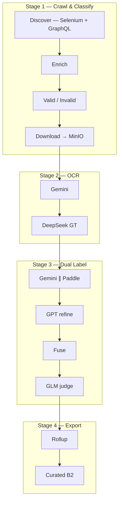
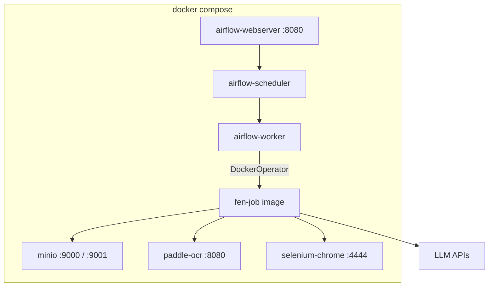

# Proposal: NLP Final Exam Pipeline — Docker Compose

> **HISTORICAL DESIGN DOC — do not run commands in this file as a how-to.**  
> **Current operations:** [`README.md`](../README.md), [`USER_SETUP.md`](USER_SETUP.md), [`LABEL_DUAL_OUTPUT.md`](LABEL_DUAL_OUTPUT.md), [`PIPELINE_BUILD_DEPLOY_RUN.md`](PIPELINE_BUILD_DEPLOY_RUN.md), [`CRAWL_STATE.md`](CRAWL_STATE.md).  
> Primary submit path is **label dual** (`ocr/label_dual_pilot/task_b2.jsonl`, `flush_posts=5`).  
> Section “Quick demo” / `make load-sample` / `make trigger-demo` below are **obsolete** (those Make targets do not exist).

> **Purpose (archive):** Original architecture proposal for repo `implement_nlp_pipeline_for_exam` for **thesis graders**.  
> Deploy in **one mode only: Docker Compose** (Airflow + MinIO + Paddle + Selenium).

**Version:** `v0.2-proposal` (archived)  
**Date:** 2026-08-31  
**Repo:** `features/implement_nlp_pipeline_for_exam`

---

## 1. Summary

### 1.1 Problem

The exam repo must be **self-contained**; graders only need Docker Desktop — `docker compose up` / `make up` should be enough to run it.

### 1.2 Solution — **one Docker Compose mode**

| Component | Docker service |
|-----------|----------------|
| Orchestration | `airflow-webserver` + `airflow-scheduler` |
| Object storage | `minio` |
| OCR branch B | `paddle-ocr` (FastAPI, built from Dockerfile) |
| GraphQL crawl | `selenium-chrome` |
| Job runner | `fen-job` container (entrypoint `run_job.py`) |
| LLM | External APIs (Gemini / GPT / DeepSeek / GLM) — keys in `.env` |

| Layer | Approach in the exam repo |
|-------|---------------------------|
| Run jobs | `DockerOperator` → image `fen-exam-fen-job` |
| MinIO | `http://minio:9000` (compose network) |
| Paddle | `http://paddle-ocr:8080` |
| Python job dependencies | Pre-built into the `fen-job` image |
| Deploy DAGs | `make deploy` to bucket `airflow` + sidecar sync (or `make up-dev` bind-mount `./dags`) |

---

## 2. Business pipeline (logic unchanged)

### 2.1 Flow



### 2.2 GraphQL in crawl — **Yes**

```
Selenium (cookies FB) → scroll feed → capture GraphQL (CDP)
  → replay GroupsCometFeedRegularStoriesPaginationQuery
  → parse caption/images → enrich permalink if missing → download CDN → MinIO
```

Code: `final_exam_nlp_v5_discover.py`, `final_exam_nlp_graphql_batch.py`, `final_exam_nlp_v5_enrich.py`

**For graders:** ship `sample_data/` so crawl can be skipped when FB cookies are unavailable.

### 2.3 DAG ↔ Job ↔ MinIO

| Stage | DAG | `FEN_JOB` | MinIO output |
|-------|-----|-----------|--------------|
| Crawl | `final_exam_nlp_crawl_pipeline` | `v5_discover/enrich/download` | `valid_post.jsonl`, `images/` |
| OCR | `final_exam_nlp_ocr_pipeline` | `final_exam_nlp_ocr` | `ocr_result.jsonl` |
| Label dual | `final_exam_nlp_ocr_label_dual_pipeline` | `final_exam_nlp_ocr_label_dual` | `task_b2.jsonl` |
| GLM | `final_exam_nlp_gt_confidence_judge_pipeline` | `gt_confidence_judge` | `glm/recommend.jsonl` |
| Rollup | `final_exam_nlp_consensus_rollup_pipeline` | `consensus_rollup` | `consensus_rollup.jsonl` |
| Curated | new script/DAG | `hitl_curated_export` | `selected_hitl_pass_b2.*` |

Bucket: `final-exam-nlp-raw` · Prefix: `facebook/{group_id}/`

---

## 3. Docker Compose architecture

### 3.1 Diagram



### 3.2 `docker-compose.yml` (services)

| Service | Image | Port | Notes |
|---------|-------|------|-------|
| `minio` | `minio/minio` | 9000, 9001 | Buckets `final-exam-nlp-raw` + `airflow` |
| `postgres` | `postgres:15` | — | Airflow metadata DB |
| `airflow-init` | `fen-airflow` | — | migrate + create admin |
| `airflow-webserver` | `fen-airflow` | 8080 | UI |
| `airflow-scheduler` | `fen-airflow` | — | |
| `airflow-worker` | `fen-airflow` | — | CeleryExecutor or LocalExecutor |
| `paddle-ocr` | `fen-paddle-ocr` | 8080 | CPU by default; GPU via `deploy.resources` |
| `selenium-chrome` | `selenium/standalone-chrome` | 4444 | GraphQL crawl |
| `fen-job` | `fen-job` | — | `profiles: [job]` — do not auto-start |

Volumes: `minio-data`, `fen-python-deps`, `selenium-profile` (cookies)

### 3.3 Running jobs via `DockerOperator`

Module `dags/jobs/common/docker_executor.py` spawns a `fen-job` container on the same Docker network (mount `/var/run/docker.sock` into Airflow).

```python
# Airflow task runs fen-exam-fen-job image with FEN_JOB=<job_name>
```

Env inside the job container:
```
FEN_RUNTIME=docker
FEN_MINIO_ENDPOINT=http://minio:9000
PADDLE_SERVICE_URL=http://paddle-ocr:8080
SELENIUM_REMOTE_URL=http://selenium-chrome:4444/wd/hub
```

### 3.4 Docker images to build

| Image | Dockerfile | Contents |
|-------|------------|----------|
| `fen-paddle-ocr` | `docker/paddle-ocr/Dockerfile` | FastAPI + PaddleOCR |
| `fen-airflow` | `docker/airflow/Dockerfile` | `apache/airflow:2.10.5` + `requirements.txt` + DAGs |
| `fen-job` | `docker/fen-job/Dockerfile` | Python 3.12 + jobs + entrypoint `run_job.py` |

---

## 4. Repo structure

```
implement_nlp_pipeline_for_exam/
├── README.md
├── .env.example
├── docker-compose.yml
├── docker-compose.minimal.yml    # MinIO + Airflow + Paddle (no Selenium)
├── Makefile                      # make up | down | down-v | deploy | verify | …
│
├── docker/
│   ├── airflow/Dockerfile
│   ├── fen-job/Dockerfile
│   └── paddle-ocr/Dockerfile
│
├── dags/
│   ├── config.ini.example
│   ├── requirements.txt
│   ├── pipelines/                # subset FEN DAGs (docker executor)
│   └── jobs/                     # job Python (crawl, OCR, label)
│
├── scripts/
│   ├── bootstrap.sh              # cp .env, build images, compose up
│   ├── load_sample_data.sh
│   ├── trigger_demo.sh
│   └── verify_pipeline.sh
│
├── sample_data/
│   ├── minio_seed/
│   └── expected/
│
├── docs/
│   ├── PROPOSAL_DOCKER_EXAM_PIPELINE.md
│   └── GRADER_GUIDE.md
│
└── tests/
```

The exam repo uses Docker Compose only (no cluster manifests).

---

## 5. `.env.example` configuration

```bash
MINIO_ROOT_USER=admin
MINIO_ROOT_PASSWORD=admin
FEN_BUCKET_RAW=final-exam-nlp-raw
FEN_MINIO_ENDPOINT=http://minio:9000
FEN_GROUP_ID=322453387859386
PADDLE_SERVICE_URL=http://paddle-ocr:8080
SELENIUM_REMOTE_URL=http://selenium-chrome:4444/wd/hub

RAMCLOUDS_API_KEY=
RAMCLOUDS_BASE_URL=https://ramclouds.me/v1

FEN_RUNTIME=docker
AIRFLOW_UID=50000
```

`scripts/bootstrap.sh` generates `dags/config.ini` from `.env`.

---

## 6. Grading workflow

### Obsolete quick demo (do not run)

The old targets `make up-minimal` / `make load-sample` / `make trigger-demo` are **not** in the current Makefile. Use the live path below (or [USER_SETUP.md](USER_SETUP.md)).

### Full pipeline (with API keys + FB cookies)

```bash
git clone https://github.com/tuancaokaizen/hcmus_nlp_final_exam.git
cd hcmus_nlp_final_exam
git checkout main
cp .env.example .env
make configure && make up && make fb-login-manual
# Airflow UI http://localhost:8080 — unpause fen_e2e_pipeline → trigger
# See README.md / USER_SETUP.md for trigger JSON (batch_target, ocr_limit, flush_posts)
make verify
```

---

## 7. Grader machine requirements

| Resource | Minimum | Recommended |
|----------|---------|-------------|
| CPU | 4 cores | 8 cores |
| RAM | 16 GB | 32 GB |
| Disk | 50 GB | 100 GB |
| Docker | 24.0+ | + Compose v2 |
| GPU | Not required | 1× NVIDIA (faster Paddle) |

---

## 8. Implementation plan

| Phase | Work | Time |
|-------|------|------|
| 0 | `docker-compose.yml`, Dockerfiles, `Makefile`, `bootstrap.sh` | 1–2 days |
| 1 | Sync `dags/jobs` + docker executor adapter | 2–3 days |
| 2 | `sample_data/` + `load_sample_data.sh` + `verify` | 1–2 days |
| 3 | `GRADER_GUIDE.md`, README, e2e test on a clean VM | 1 day |

---

## 9. Done criteria (archive — verify against live docs)

1. `make up` → Airflow :8080, MinIO :9001, Paddle healthy  
2. `make fb-login-manual` + trigger **`fen_e2e_pipeline`** → `ocr/label_dual_pilot/task_b2.jsonl` on MinIO  
3. B2 submit columns per [LABEL_DUAL_OUTPUT.md](LABEL_DUAL_OUTPUT.md) (includes `fuse_gt` when GLM on)  
4. `make verify` passes  
5. [GRADER_GUIDE.md](GRADER_GUIDE.md) + [USER_SETUP.md](USER_SETUP.md) — Docker Desktop only  

(Obsolete checklist items such as `make load-sample` / `make trigger-demo` are removed.)

---

## 10. ADR

| Decision | Rationale |
|----------|-----------|
| **Docker Compose only** | Graders only need Docker Desktop |
| Keep GraphQL crawl | Matches business logic; `sample_data` to skip when not crawling live |
| `DockerOperator` + `run_job.py` | Single job entrypoint; no forked business logic |
| LLM via API | Do not bundle model weights |

---

## Appendix — Main modules in the repo

| Component | Path |
|-----------|------|
| Crawl + GraphQL | `dags/jobs/fen_crawl_*.py`, `final_exam_nlp_graphql_batch.py` |
| OCR / Label dual / GLM | `dags/jobs/final_exam_nlp_ocr*.py` |
| Paddle service | `docker/paddle-ocr/` |
| DAGs | `dags/pipelines/fen_*.py` |

---

*v0.2 — Docker Compose only.*
